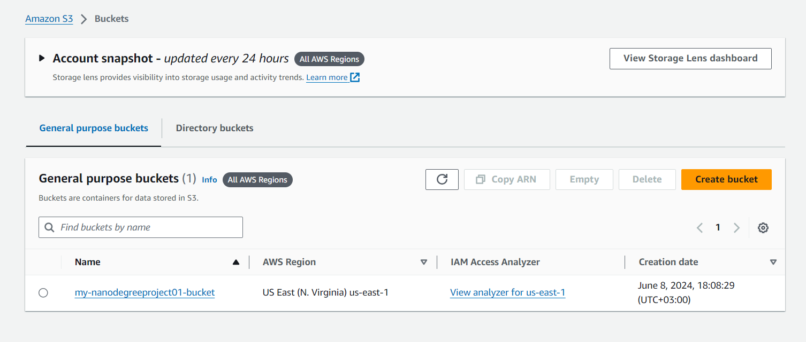
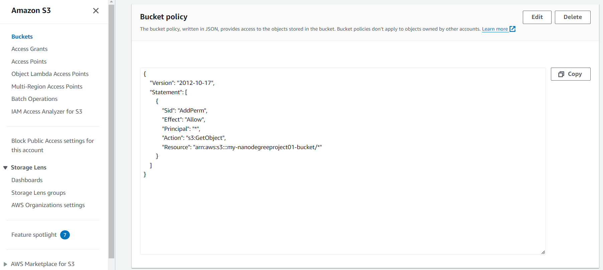
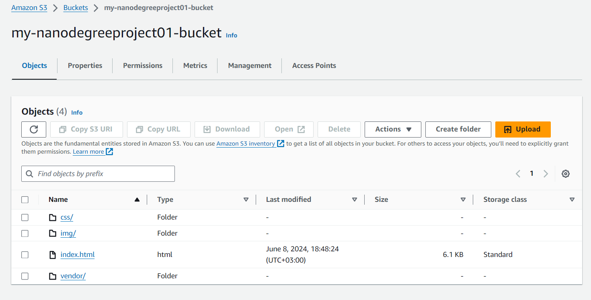
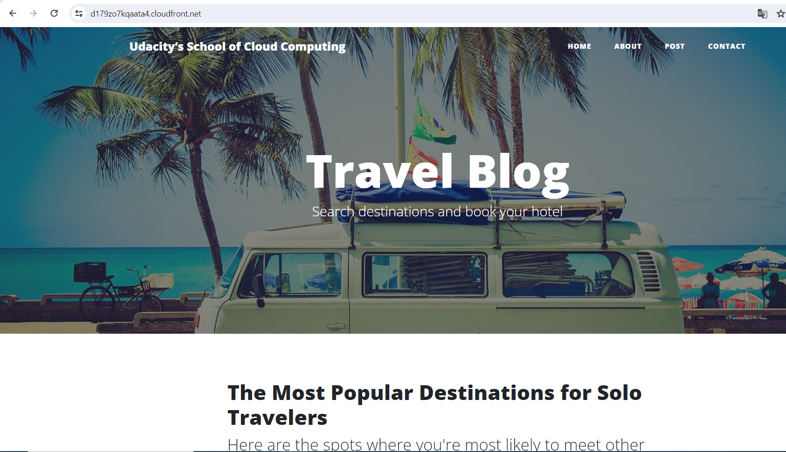
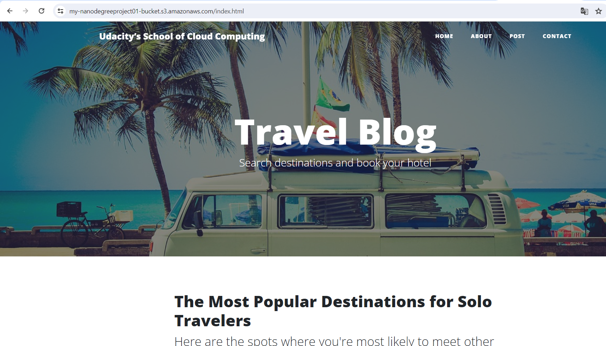

# deploy-static-website-on-aws
This is the first project of Cloud Developer Course on Udacity

# Project Steps

## Created S3 Bucket

## S3 Bucket Policy

## Created S3 Bucket's Content Files

## CloudFront Distributions

# Access Website in Web Browser

1. Open a web browser like Google Chrome, and paste the copied CloudFront domain name:

https://d179zo7kqaata4.cloudfront.net

2. Access the website via website-endpoint

http://my-nanodegreeproject01-bucket.s3-website-us-east-1.amazonaws.com/

3. Access the bucket object via its S3 object URL

https://my-nanodegreeproject01-bucket.s3.amazonaws.com/index.html

